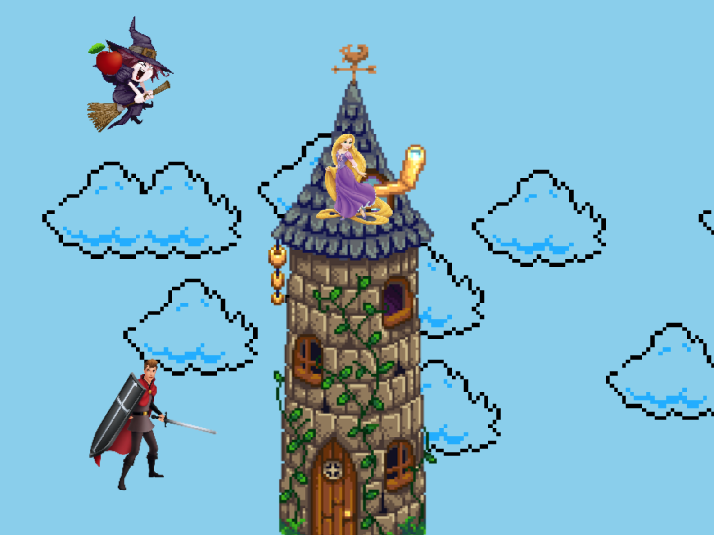

:warning: Everything between << >> needs to be replaced (remove << >> after replacing)

# Tower Rescue: Dodge the Witch's Apples
## CS110 Final Project   Spring, 2024 

## Team Members

Carol Zhang
Ashley Mera

*** 

## Project Description

For this project, there will be a girl in a tower that needs to be saved. Your character is supposed to save the girl but there is a evil witch at the top of the tower with the girl.Your objective is to save the girl by climbing the tower while apples are being thrown at you by the witch and getting to the top of the tower.

***    

## GUI Design

### Initial Design

### Final Design

## Program Design

### Features
1. "Press start"
2. Moving characters
3. Witch with her apple
4. Tower background
5. "You win!"
=======

### Classes
Character class: represents the main characters and the character can move in various directions and perform actions like jumping 
Tower class: represents the tower and checks for collisions with the character to determine if the character has reached the top 
Witch class: the witch can throw apples at the character
Apple class: represents the apples thrown and the apples move downward and can 

- Character Class: Represents the main character of the game, tasked with saving the girl from the tower. The character can move in various directions and perform actions like jumping.
- Tower Class: Represents the tower where the girl is held captive. It checks for collisions with the character to determine if the character has reached the top of the tower.
-Witch Class: Represents the evil witch at the top of the tower. The witch can throw apples at the character.
-Apple Class: Represents the apples thrown by the witch. The apples move downward and can collide with the character.
- Controller Class: Manages the game loop, handles events, updates game logic, and controls the flow of the game.

## ATP

TEST CASE 1: Player Movement for the Prince
Test Description: Verify that the player can move left, right and up.
Test Steps:
1. Start the game
2. Press the left arrow key on keyboard
3. Verify the player moves left
4. Press the right key arrow key on keyboard
5. Verify the player moves right
6. Press the Up key arrow key on keyboard
7. Verify the player moves up
Expected Outcome: The player should move left, right or up using keyboard keys.

TEST CASE 2: Player Movement for the Witch
Test Description: Verify that the player can move left, right and up.
Test Steps:
1. Start the game
2. Press "1" on keyboard to move left
3. Verify the player moves left
4. Press "2" on keyboard
5. Verify the player moves right
Expected Outcome: The player should move left, right or up using keyboard keys.

TEST CASE 3: Collision detected
Test Description: Ensure that collisions between the enemies's apples are detected correctly. You are playing the witch (Keys for witch are 1 and 2, check test case 2 for verification)
Test Steps:
1.Start the game.
2.Move keys and aim to hit the Prince
3.Verify that the apple hits the prince. It will say "Game Over"
4.Fire a player's apple that misses the prince
5. Verify that no collision is detected. The prince will win
Expected Outcome: Apples should correctly collide with Prince and end game

TEST CASE 4: Menu Navigation 
Test Description: Test the navigation through the game's menu 
Test Steps:
1. Start the Game
2. Check to see if a menu appears
3. Click "Begin Game"
4. Verify that game begins
5. Click "Quit" on menu
5. Verify that game ends
Expected Outcome: The main menu should allow the player to navigate through options and select them.

TEST CASE 5: Game Over Condition
1. Start the game
2. Play the game
3. Get hit by the apple
4. Verify that game displays "Game Over"
5. Click "Try again"
6. Verify you can play again
7. Click "Quit" 
8. Verify game ends
Expected Outcome: The game should display a "Game Over" message when the player loses and you should get the option to play again or quit.